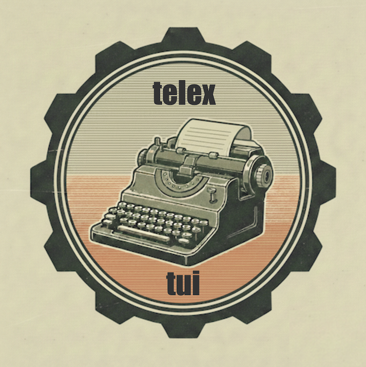

# Introduction

<div style="text-align: center; margin: 2em 0;">
  
</div>

> **⚠️ Documentation Status**
>
> This documentation is under active development and has not been fully reviewed.
> Some sections may be incomplete, outdated, or contain errors. Several features
> (Terminal, Canvas, Image, Effects) are marked as experimental with known limitations.
>
> For the most accurate information, see code examples in `crates/telex/examples/`
> and API documentation via `cargo doc --open`.

<div class="logo-container">
  
</div>

Telex is a terminal UI framework for Rust, inspired by React's component model.

```rust
use telex::prelude::*;

struct App;

impl Component for App {
    fn render(&self, cx: Scope) -> View {
        let count = state!(cx, || 0);

        View::vstack()
            .child(View::text(format!("Count: {}", count.get())))
            .child(
                View::button()
                    .label("Increment")
                    .on_press(with!(count => move || count.update(|n| *n += 1)))
                    .build()
            )
            .build()
    }
}

fn main() {
    telex::run(App).unwrap();
}
```

## Why Telex?

- **Familiar model** - If you know React, you know Telex. State, hooks, components.
- **Rust-native** - No runtime, no garbage collector. Just Rust.
- **DX-first** - Builder pattern or JSX-like macros. Your choice.

> **Note:** Telex is currently keyboard-only. Mouse support (scroll wheel, click-to-focus, widget interactions) is planned but not yet implemented.

## What you'll find here

This book takes you from hello world to building real applications:

1. **Getting Started** - Installation, first app, core concepts
2. **Building UIs** - Layouts, lists, inputs, modals
3. **Dynamic Data** - Streams, effects, async loading
4. **Widgets** - Tables, trees, tabs, forms, menus
5. **Advanced Patterns** - Keyed state, shared state, context

Each chapter builds on the last. Code examples are runnable - you'll find them in `crates/telex/examples/`.

## Running examples

Every concept has a corresponding example:

```bash
# Run a specific example
cargo run -p telex-tui --example 02_counter

# See all examples
ls crates/telex/examples/
```

> **Quick tour:** For a fast overview, run `./run-examples.sh` - an interactive menu that lets you browse and run all examples. Great for getting a feel for what Telex can do.
>
> Press **F1** in any example to see what it demonstrates.

Let's get started.
